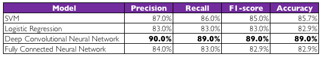

# Cats and Dogs classification challenge

This project was proposed as part of a group coursework for the Data Analytics modules at [QMUL](https://www.qmul.ac.uk/). The goal is to be able to classify correctly cat and dog audio files.

The dataset comes from [Kaggle](https://www.kaggle.com/mmoreaux/audio-cats-and-dogs).

The repository contains a number of folders and files described below:

* **data**: raw WAV files downloaded from Kaggle.
* **data exploration**:  Folder containing a few notebooks with some experiments and data exploration using [librosa](https://librosa.github.io/), [pandas](https://pandas.pydata.org/) and [NumPy](http://www.numpy.org/). From this experimentation, the final set of features extracted was narrowed down and justified.
* **data_processed**: This folder contains two subfolders: `features_mel_spectrograms` and `features_delta_spectograms`, as well as two Pandas dataframes (`training_set.pkl` and `test_set.pkl`) with the features extracted and ready for analysis.
* **keras_model_mel**: A [Convolutional Neural Network](https://en.wikipedia.org/wiki/Convolutional_neural_network) exploration using the mel and mel-deltas spectrograms from the audio files, complete with graphs, results and summary. It initially explores several learning and dropout rates to identify potentially effective ones, then it further fine tunes this into a model (saved under saved_models).
* **keras_model_mfcc**: A [Perceptron Neural Network](https://en.wikipedia.org/wiki/Perceptron) exploration using the MFCCs and MFCC deltas from the audio files, complete with graphs, results and summary. It initially explores several learning and dropout rates to identify potentially effective ones, then it further fine tunes this into a model (saved under saved_models).
* **tensorflow_model**: A similar architecture to the one in the keras_model_mel folder which uses both high and low level APIs from [Google's Tensorflow](https://www.tensorflow.org/) library. It was important to try lower level libraries to understand the programming differences involved.
* **cli**: A command line interface that can be used to either replicate the training/test data split or run live classifications on a user's wav file provided. In order to make use of this simply run:

	`cli/process_data.py` or `cli/sound_classifier.py`

This last command can accept a `--model_type` parameter that can be either `mel` or `mfcc`, as well as a path parameter if the classification is to be done on a file in the users' PC `--file_path` followed by the path to the file. Both of these parameters are optional and their defaults are
`--model_type mel and --file_path data/cats_dogs/cat_1.wav`

In addition to this, there're multiple [Jupyter Notebooks](http://jupyter.org/) in the folders numbered in order of progress. In them, there's commentary and interesting outputs we encourage exploring as the extensive exploration led to the feature selection,  model creation and fine-tuning.

Results are encouraging and a high accuracy (~89-90%) is achieved despite the small sample size.

Special thanks to [Eurico Covas](https://github.com/euricocovas), [Ines Nolasco](https://github.com/madzimia) and Nadir Badji for their work on this project
